# Static Website Hosting

## Description

The purpose of the project was to create a S3 Bucket and upload images and host them on a static website.

## Steps Taken

**### 1. Created an S3 Bucket with a DNS name to link to a URL so that I can use Route53.**

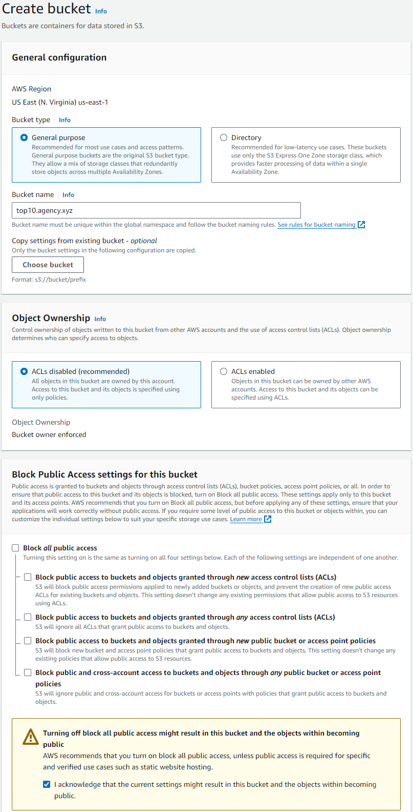

**### 2. Confirmation that bucket was created.**

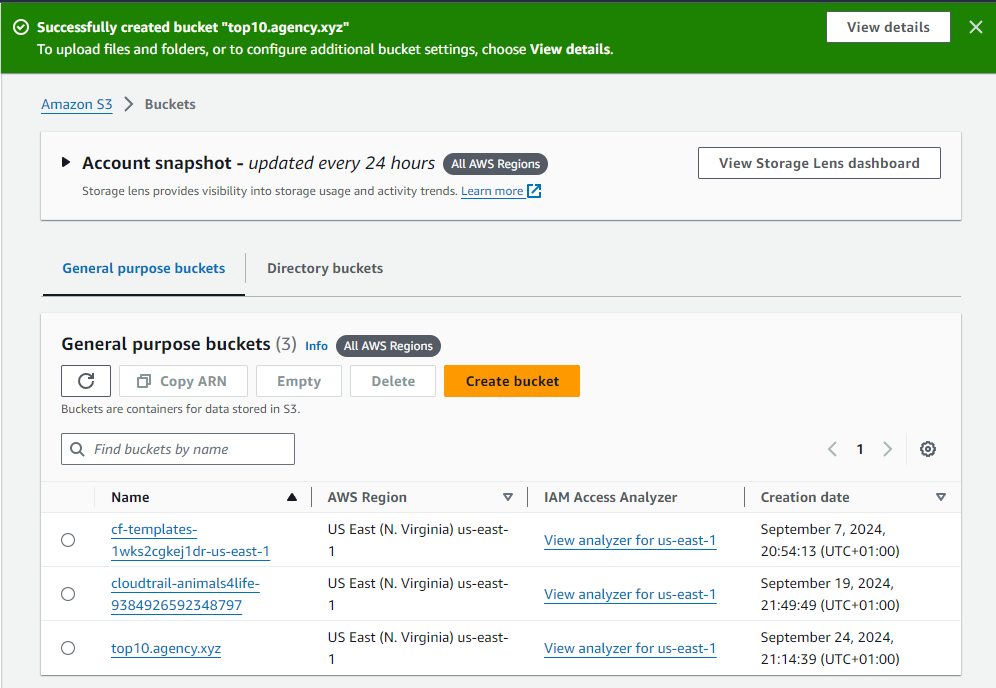

**### 3. On Properties tab at the bottom of the page the Static Hosting section.**

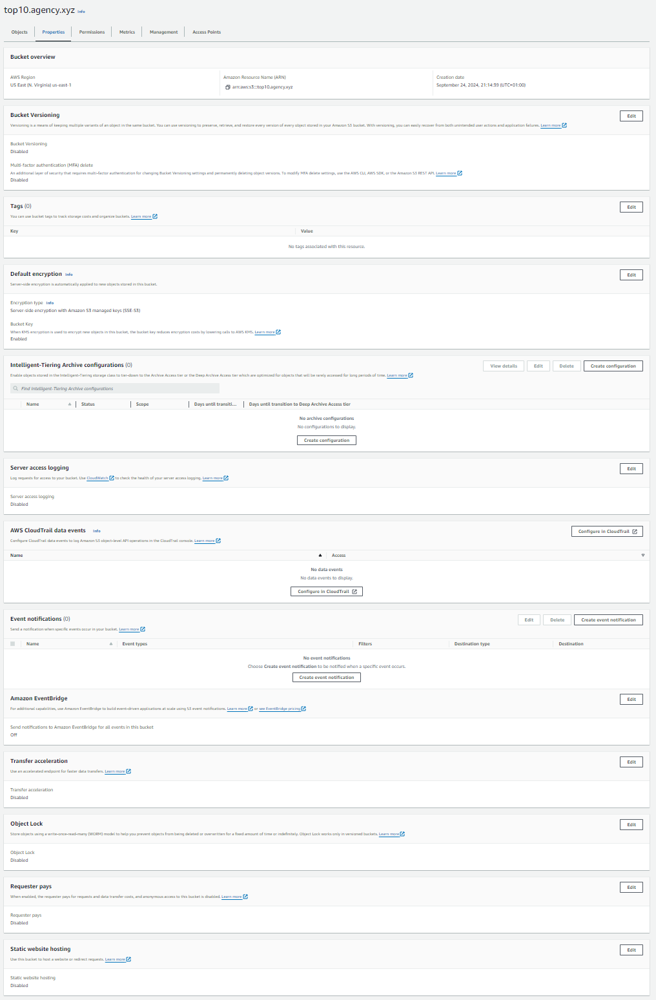

**### 4. Click into the Static Hosting section, enable static hosting and specify the index.html and error.html files.**

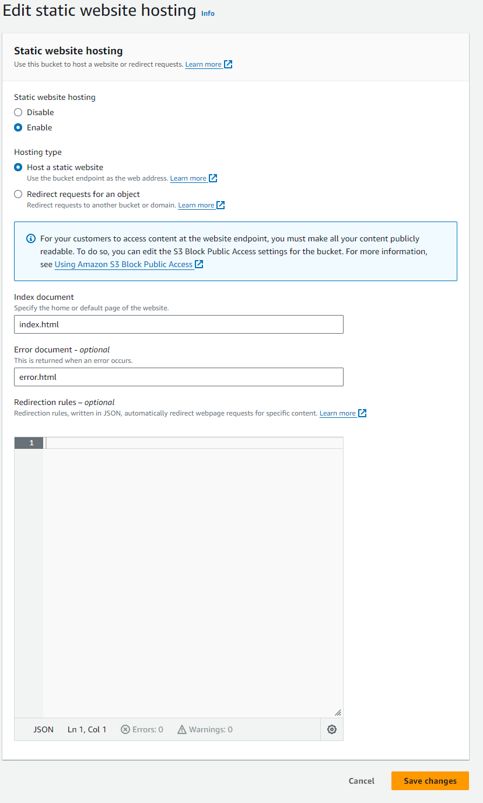

**### 5. Confirmation Static Hosting enabled and URL generated.**

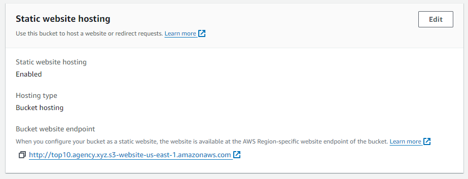

**### 6. S3 Bucket, Objects tab load files and images.**

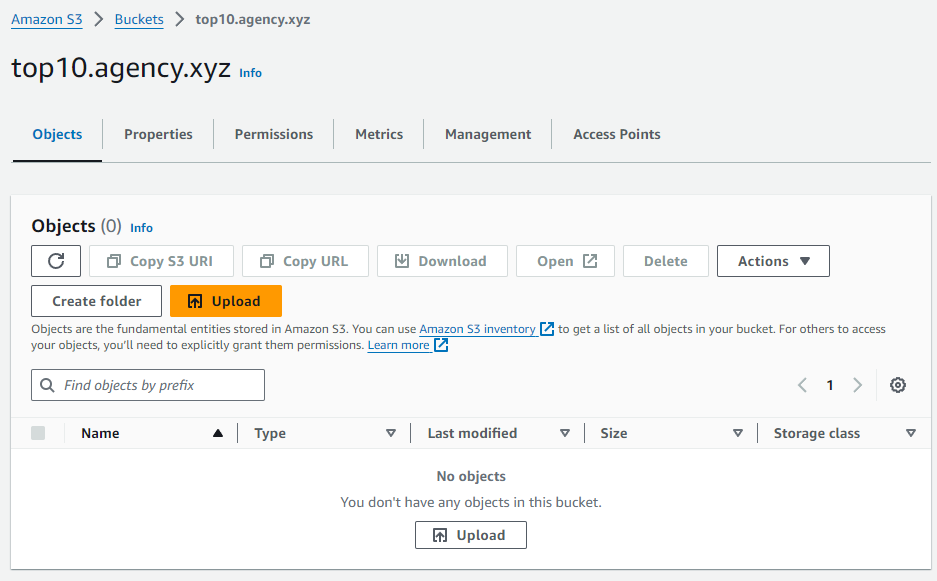

**### 7. Upload section.**

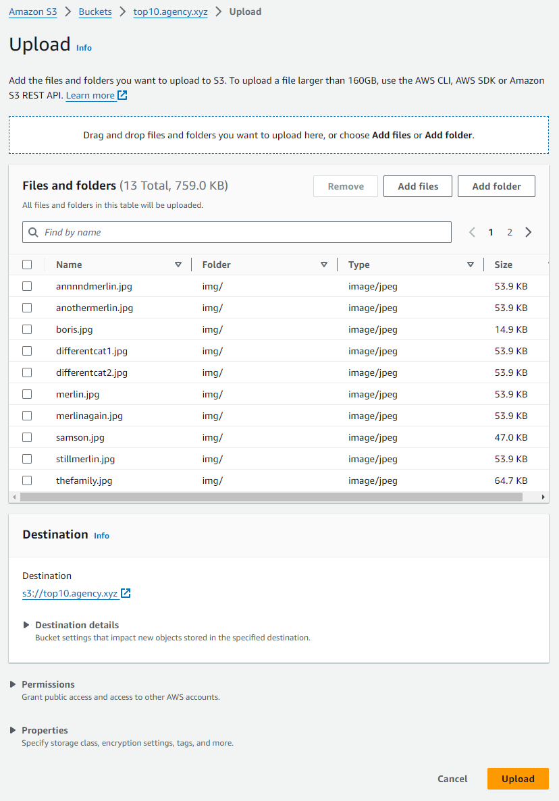

**### 8. Confirmation of uploaded files and images.**

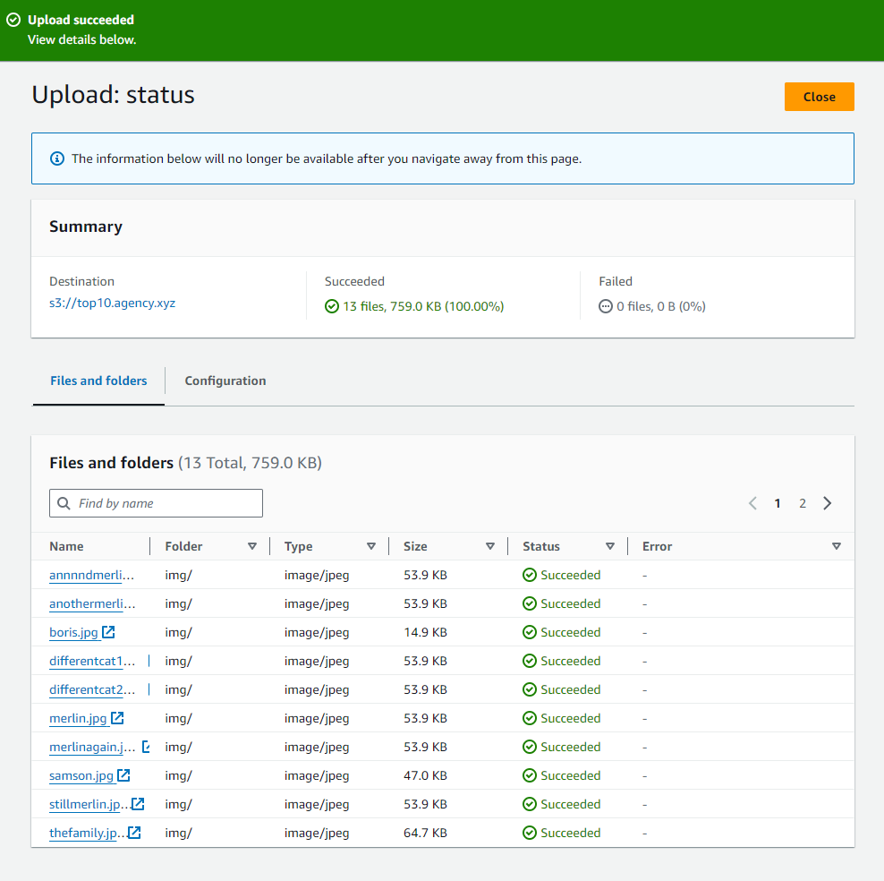

**### 9. S3 Bucket, Properties in the Static Website Hosting section launch the URL in another tab. Received a HTTP Response Code 403 Forbidden as S3 Buckets are Private by default. I needed to grant permissions for any unauthenticated user and the perferred method is use a JSON bucket policy.**

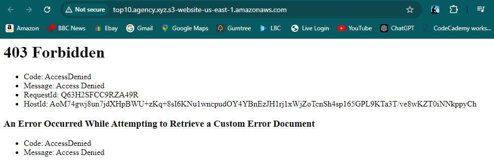

**### 10. S3 Bucket, Permission tabs went to the bucket policy section.**

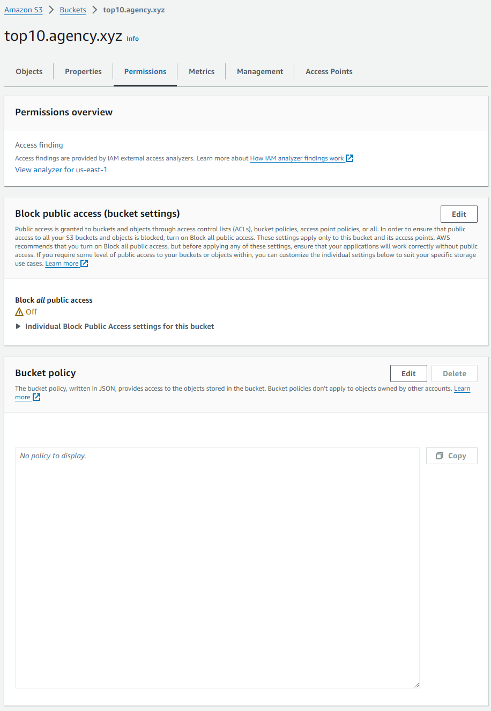

**### 11. Inserted a generic JSON bucket policy.**

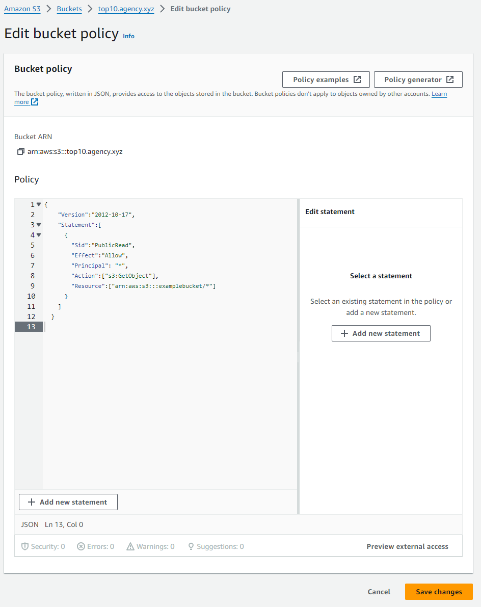

**### 12. Updated the "Resources" section with the current "ARN" (Amazon Resource Name) and save.**

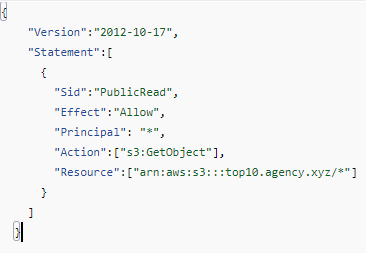

**### 13. Refresh the 403 Forbidden browser tab and the index.html page was rendered.**

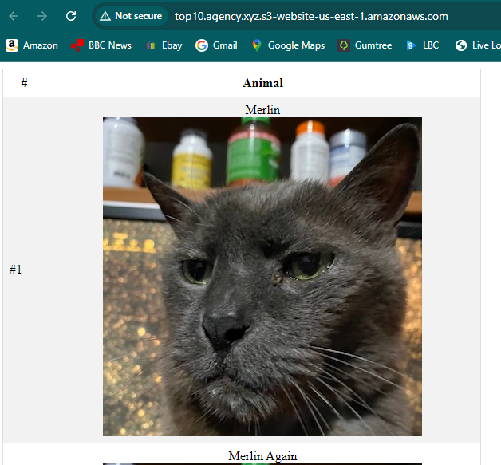

**### 14. Altered the URL to render the error.html page.**

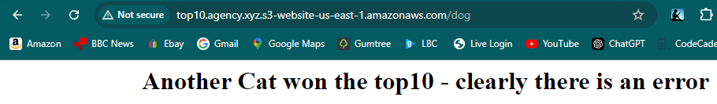

## Result

I successfully rendered a static website using an S3 bucket. 
Initially, I aimed to host the website with a custom DNS, so I followed the naming guidelines and gave the bucket a unique name. However, I mistakenly entered the URL in the bucket name incorrectly, which later caused issues when I tried to connect the bucket to Route53.

Since S3 buckets cannot be renamed without deletion, I decided to leave the project as is. I’ll take this experience as a lesson and pay closer attention in future projects to avoid similar mistakes.

Despite this, I was able to achieve the primary goal of hosting a static website on S3.
