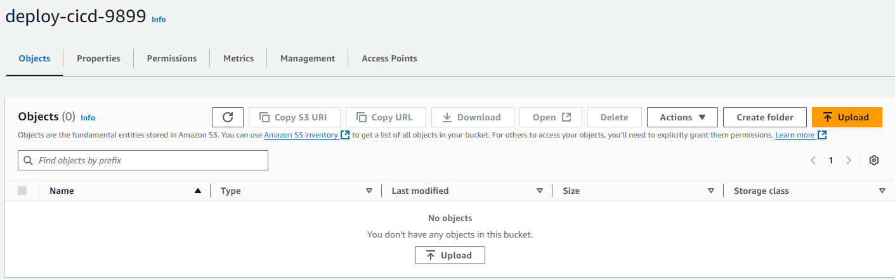
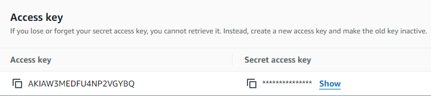
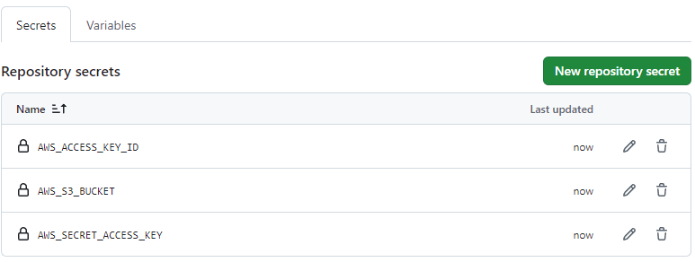
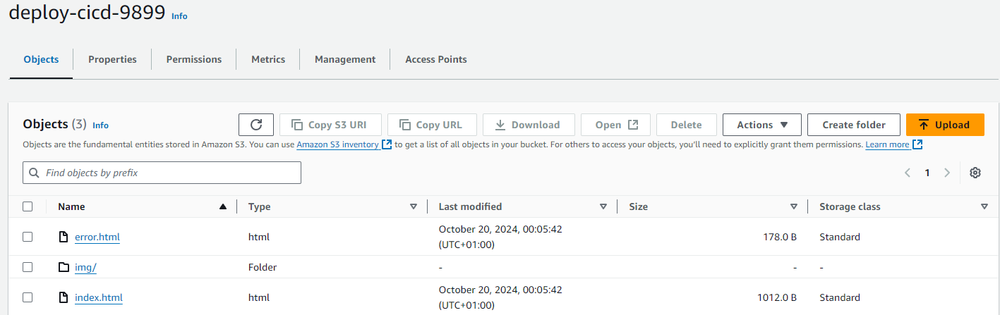
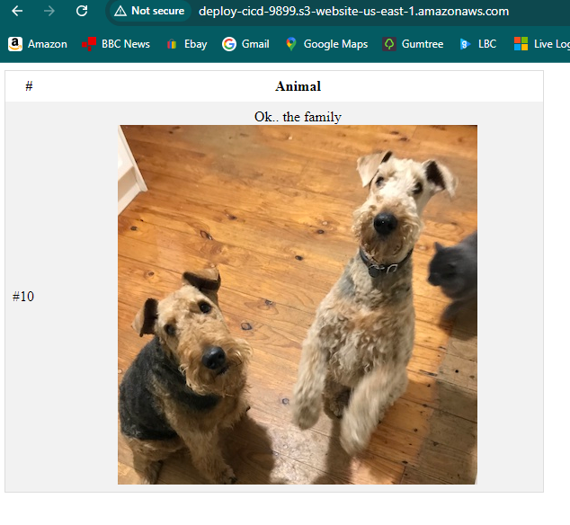
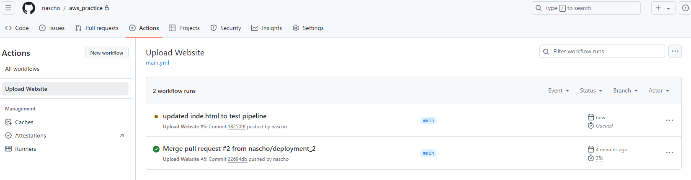
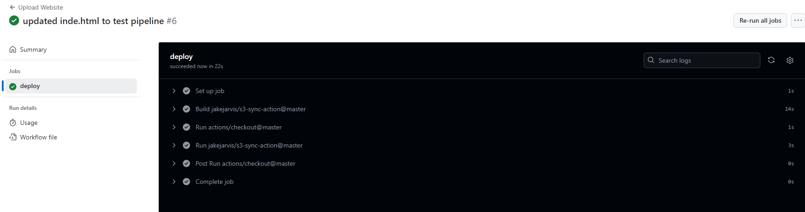
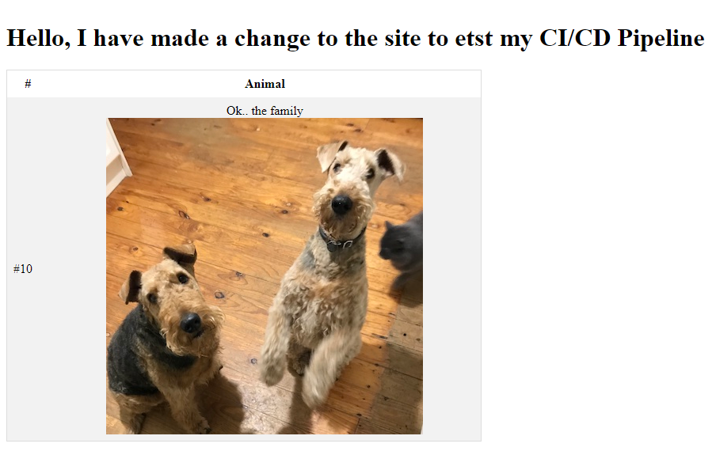

# GitHub Actions CI/CD Pipeline

## Description

The purpose of this exercise was to deploy a CI/CD Pipeline using GitHub Actions, then make changes to the website and verify if they rendered on the website.

## Steps Taken

1. Visited GitHub Marketplace and copied a .yml template for S3 Sync, which can be found in the policies.json file. With the policy created a .github/workflows folder with the .yml file for starting the process to connecting the pipeline.

2. Created an S3 Bucket and enabled for static hosting and contained zero objects.

3. Created an IAM User with Access ID credentials to provide GitHub access to S3 (no longer valid, bucket deleted).

5. In GitHub Secrets and Variables updated with AWS Access ID and Secret Access.

6. Pushed deployment branch from VSCode to GitHub.

7. Merged deployment branch into main branch and GitHub Actions connected with AWS S3 and updated S3 with the static website files.

8. Checked the S3 dashboard and verified that the files had been uploaded.

9. Confirmed the website was running.

10. Made changed to the index.html page, then pushed the changes to GitHub and merged. Then checked that GitHub Actions made deployed the changes.

11. Checked website again to verify changes had rendered.

12. Tear down process in AWS.

## Result

I was successfully in achieving initial goal to deploying a CI/CD Pipeline using GitHub Actions.
I set up and deployed a static website to S3 using a YAML file and was then able to make changes to the index.html file which were then rendered.

I learnt how to use GitHub Marketplace to create my YAML and file and also used AWS policy generator the create an S3 Bucket policy.

During the process I made a number of mistakes however, I enjoyed the entire experience as it taught me something I did not know already.
