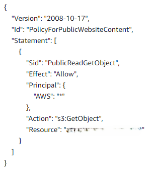
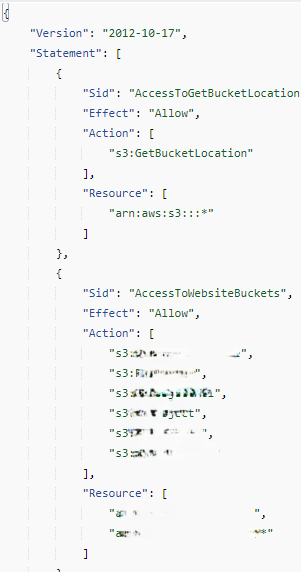
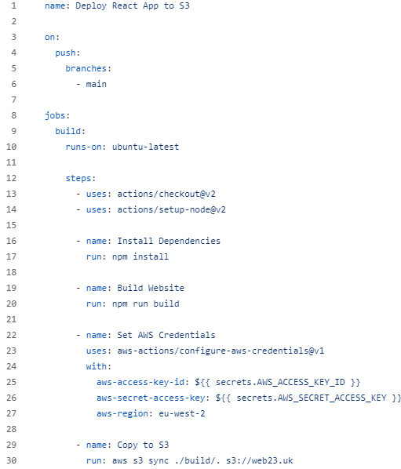
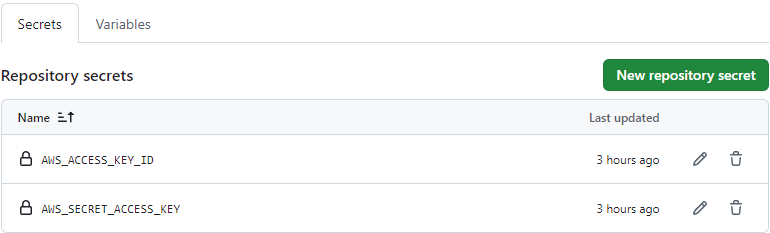
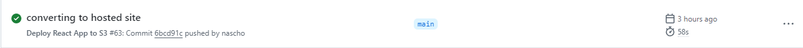
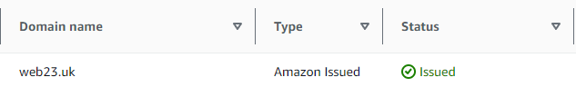
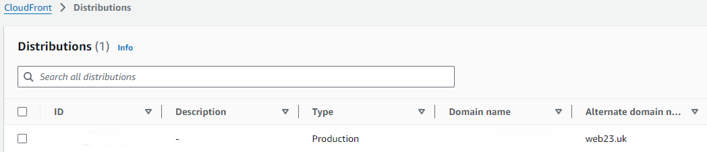

# ReactJS Application Deployed with GitGub Actions CI/CD and CloudFront for CDN.

## Description

The purpose of this project was to deploy a React Application namely my Portfolio Website to an S3 Bucket using GitHub Actions (CI/CD), set a custom domain with Route 53 and use CloudFront for distribution.

## Steps Taken

1. Created an S3 Bucket with the domain name I will use as my URL, enabled static hosting and updated the busket policy.

2. Created an IAM Policy to give GitHub access to S3 then created an IAM User.

3. Created a .GitHub/Workflow/deploy.yml file to set up a pipeline with GitHub.

4. Set up GitHub secret variables to store Access Keys and Secret Access Keys.

5. Pushed to Main Branch to activate GitHib Actions.

6. Launched website and checked the pipeline was working.

7. Set up Hosted Zones in Route 53 and use a custom domain.

8. AWS Certificate Manager to issue a SSL/TLS certficate for the custom domain.

9. Since using an S3 Bucket to store the React Application it does not support HTTPS therefore, I used CloudFront to distribute the website and connect the custom domain with a SSL/TLS certififcate and giving the ability to use HTTPS.

## Result

I was successfully in achieving initial goal to deploying a CI/CD Pipeline using GitHub Actions to an S3 Bucket and then using a custom domain with CloudFront.

I set up and deployed a ReactJS website to S3 using a .Github/Workflow file and was then able to make changes to the application which were then rendered.

I learnt how to create an S3 Bucket Policy and IAM Policy and use .Github/Workflow file. Also how to set up a CI/CD Pipeline to GitHub and automate rendering the application when changes are made.

During the process I made a numerous mistakes and had to use different resources for information in order to complete the project. I learnt some new skills and also had the opportunity to further practice processes that I had only learnt a week ago, overall it was an enjoyable experience once I had managed to achieve my original goal.
