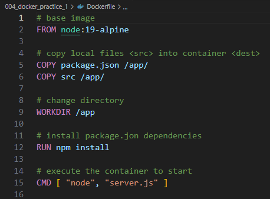
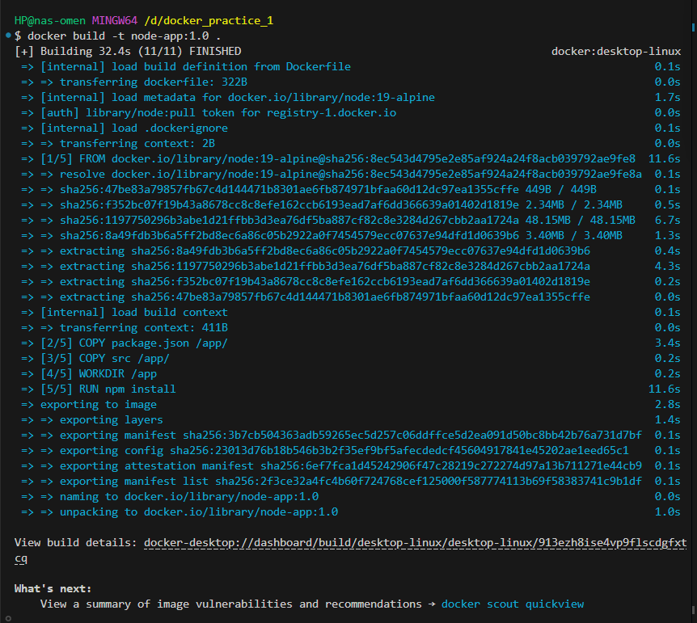
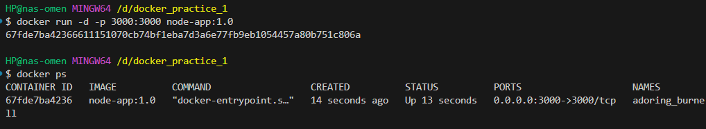
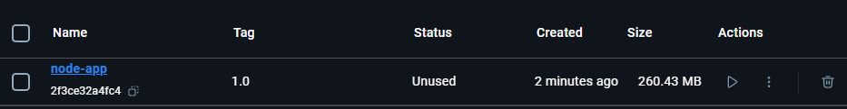
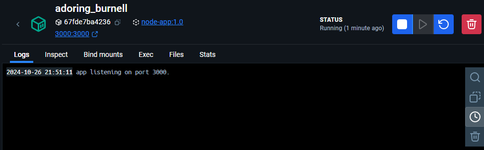

# Docker Build test.

## Description

The purpose of this exercise was to build a simple Node Express Dockerfile and use the commands that are needed to create a Docker build.

## Steps Taken

1. Created a simple Node Express server.js file for testing

2. Created a Dockerfile. 

3. Ran the docker run command in the terminal.

4. Created a container to run the docker image that had been built.

5. checked Docker Desktop to verify that the image and container both visable in GUI.

## Result

I was successfully in achieving my goal of learning the basics of Docker and using the terminal commands. Also I was also able to create my own image and launch the container.
